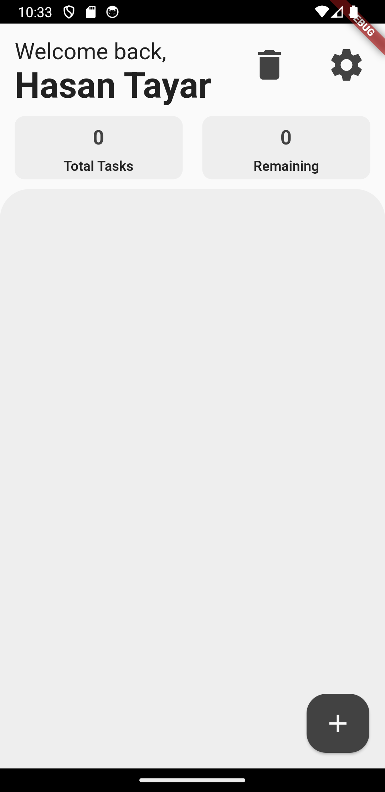
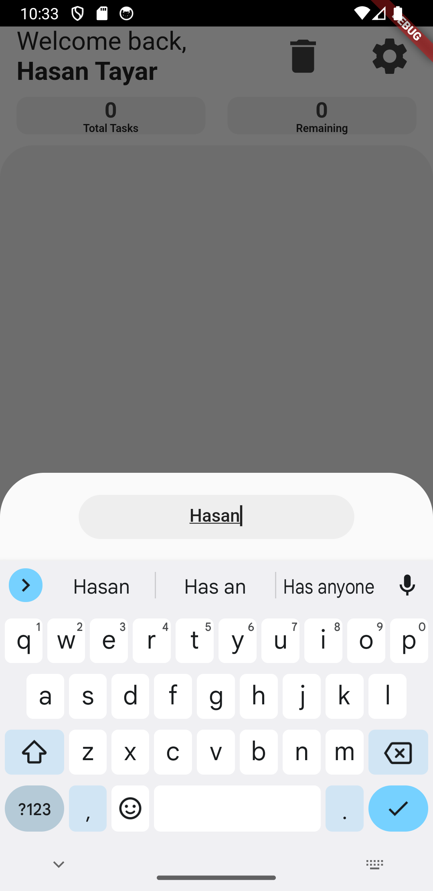
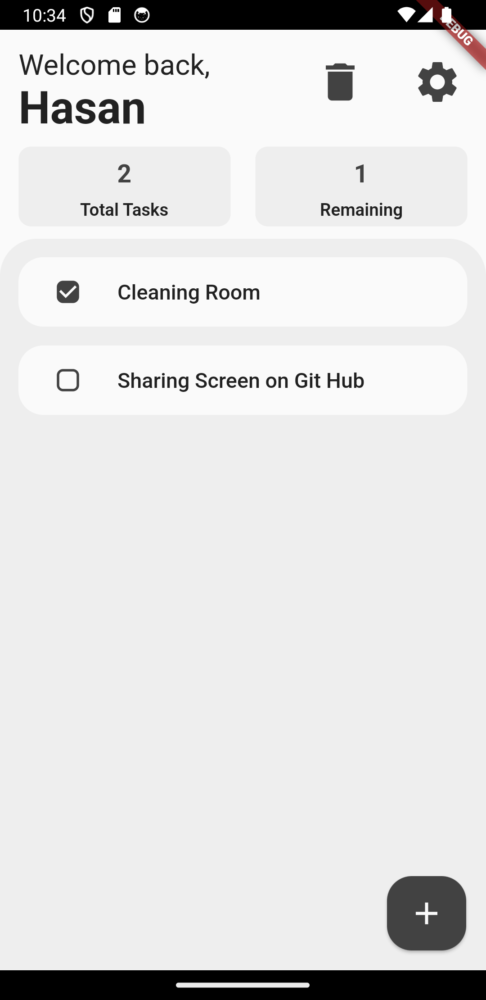
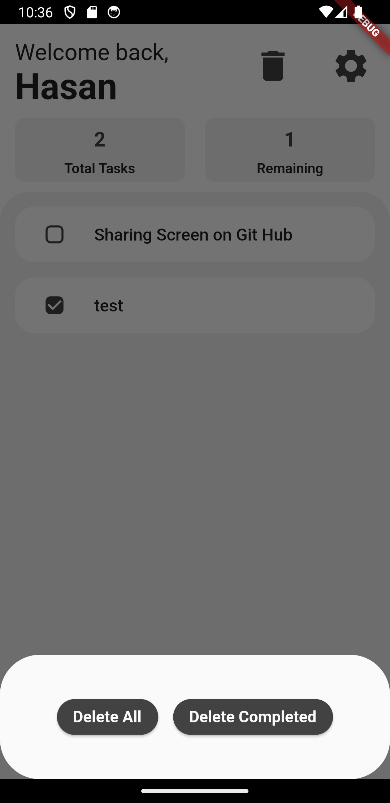
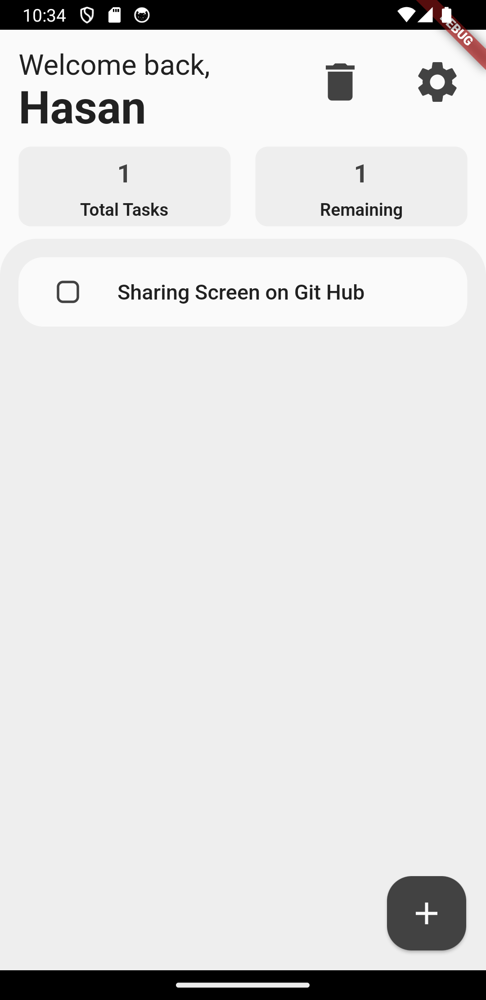

# To-Do App

This is a simple to-do app built with Flutter to help understand the basics and some advanced concepts of the framework.

## Getting Started

These instructions will get you a copy of the project up and running on your local machine for development and testing purposes.

### Prerequisites

Make sure you have Flutter installed on your local machine. For more instructions on how to install flutter, look [here](https://flutter.dev/docs/get-started/install).

## Installing

1. Clone the repo:
```bash
git clone https://github.com/HasanTayar/To-Do-App.git
```
2. Change the directory:
```bash
cd To-Do-App
```
3. Install dependencies:
```bash
flutter pub get
```
4. Run the app:
```bash
flutter run
```
## Features
- Add new tasks
- Mark tasks as complete
- Delete tasks

## Built With

- [Flutter](https://flutter.dev) - The UI framework used
- [Provider](https://pub.dev/packages/provider) - State Management
- [https://dart.dev/](https://dart.dev/) - Language

## Screenshots
### Main Screen:



### Editing Username:



### Marking Tasks:



### Delteting Buttuns:



### After Deleting:



## Acknowledgments

- Inspired by the countless number of to-do apps out there.
- Big thanks to Flutter's awesome community.

## Contact 
- GitHub: [@HasanTayar](https://github.com/HasanTayar)
- Email: [HasanTayar1602@gmail.com](mailto:HasanTayar1602@gmail.com)


